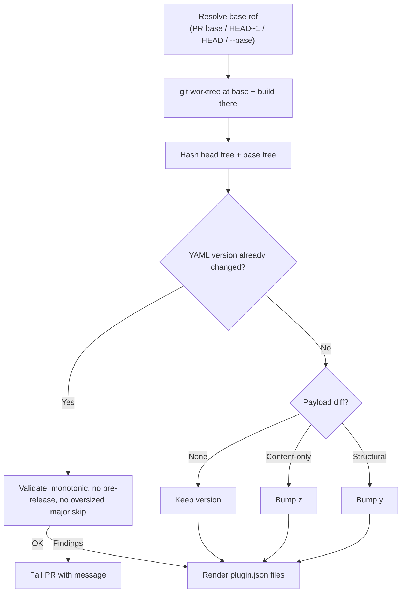

# Plugin Versioning Strategy

## Important Links

- [Claude Code plugins reference](https://code.claude.com/docs/en/plugins-reference)
- [OpenAI Codex build plugins docs](https://developers.openai.com/codex/plugins/build)
- [Anthropic official Claude plugin marketplace](https://github.com/anthropics/claude-plugins-official)
- [OpenAI curated Codex plugins repo](https://github.com/openai/plugins)

## BLUF

Use **independent SemVer per plugin**.

Automation owns `y` and `z`. Builders own `x`.

```yaml
# plugins.d/nvidia-skills.yml
name: nvidia-skills
version: "1.2.3"
include_skills:
  - skills/aiq-deploy/
  - skills/aiq-research/
```

```yaml
# plugins.d/_defaults.yml — applies to every catalog plugin
version: "1.0.0"
```

Decision:

- **Content-only change** (existing skill files edited, asset bytes changed) → automation bumps `z`.
- **Structural change** (skill add/remove, capability change, asset path change) → automation bumps `y`.
- **Major bump** (breaking change for downstream users) → builder sets `version:` explicitly. Automation validates the edit but doesn't infer `x`.
- **Builder set any version** → automation validates (monotonic, no pre-release, no oversized major skip) and respects it.
- Generated `.claude-plugin/plugin.json` and `.codex-plugin/plugin.json` copy YAML `version`.

Why automation handles `y` and `z`: every PR has a reviewer who already sees the proposed version delta alongside the diff that triggered it. The reviewer can push back if the magnitude is wrong. Gating contributor pushes on a manual bump just adds friction without adding signal.

Why builders still own `x`: a major bump is a claim about downstream consumers ("this breaks something you depend on"), not a property of the diff. Automation can't infer it.

## Scope

In scope:

- **Catalog plugins** (driven by `plugins.d/<name>.yml`). `plugin.json` is generated; YAML `version` is the source of truth.

Out of scope:

- **Curated plugins** (driven by `plugins/<name>/.skills-manifest.yml`, where `plugin.json` is hand-maintained). Their hand-maintained `.claude-plugin/plugin.json` is the source of truth; automation never edits it.
- **Marketplace entries** (`.claude-plugin/marketplace.json`, `.agents/plugins/marketplace.json`). They do not carry per-plugin version fields. Per-plugin `plugin.json` is authoritative; clients prefer it over the marketplace entry (see [Research Appendix](#research-appendix)).
- **Marketplace `metadata.version`** stays static; bumping it is a separate decision.

## Why This Matters

Users need version numbers to mean something:

- **No version change**: no meaningful shipped change.
- **Patch**: refreshed existing skill content.
- **Minor**: plugin capability set changed.
- **Major**: review before updating.

This keeps update prompts trustworthy and gives external marketplaces a clear handoff version.

## Ownership Model

| Version Part | Owner | Triggered by |
|---|---|---|
| `x` major | Builders | Breaking behavior, rename, large compatibility shift. Builder edits `version:` explicitly; automation only validates. |
| `y` minor | Automation | Skill added/removed, capability/default-prompt change, logo/composer_icon/screenshot path added/removed/changed (user-visible discovery surface). |
| `z` patch | Automation | Existing skill instructions/references/evals/scripts changed; in-place asset byte changes (resized logo, recompressed screenshot). |

Automation classifies the change from the diff shape and writes the bump back to `plugins.d/<name>.yml`. Builders can pre-empt automation by setting `version:` themselves — automation will accept any builder-set version that passes validation, even a "wrong-magnitude" choice (the reviewer is the backstop, not CI).

## Validation Rules

When a PR already changed YAML `version`, automation only enforces mechanical safety, not semantic policy:

1. **Monotonic**: new version must be strictly greater than base version (SemVer compare).
2. **No pre-release tags**: `version` must match `^\d+\.\d+\.\d+$`. `-rc` / `+sha` suffixes are rejected (both Claude and Codex compare SemVer semantically; pre-release ordering is an extra failure mode we don't need yet).
3. **No oversized major skip**: `1.2.3 → 1.2.99` is allowed; `1.2.3 → 5.0.0` requires an explicit signal in the PR. This guards against typos.

Magnitude-vs-change-shape is intentionally **not** validated. If the builder writes `1.2.3 → 1.2.4` on a PR that adds a skill, automation accepts it. The reviewer sees both the bump and the added skill in the diff and pushes back if it's wrong.

## Builder DX

> **Note on current state.** This section describes the steady-state once bot-pushed writeback ships (see [Future Work](#future-work)). Today the sync workflow already auto-applies bumps; contributor PRs run `--check` only, so contributors still run `version-plugins.sh --apply --base origin/main` locally and commit the bump themselves. The version semantics below are identical either way.

### Existing Skill Content Changed

Builder edits an existing included skill (e.g. `skills/aiq-deploy/SKILL.md`). Automation bumps `z`:

```text
1.2.3 -> 1.2.4   (content-only change)
```

No builder action on `version:` required.

### Skill Added Or Removed

Builder changes plugin composition:

```yaml
include_skills:
  - skills/aiq-deploy/
  - skills/aiq-research/
  - skills/new-skill/
```

Automation bumps `y`:

```text
1.2.3 -> 1.3.0   (structural change: skills added: new-skill)
```

No builder action on `version:` required. The reviewer sees the y-bump alongside the added skill and decides if the magnitude is right.

### Major Bump (Breaking Change)

If the change breaks downstream consumers — renaming a plugin, removing capabilities users depend on, redefining behavior — the builder edits `version:` explicitly:

```yaml
version: "2.0.0"
```

Automation validates (monotonic, no pre-release, no oversized skip) and respects it.

### Builder Override Rule

If the PR already changes YAML `version`, automation never bumps on top of it. Two common shapes:

```text
Builder knows there's a breaking change automation can't see:
  Base: 1.2.3
  PR: small content edit + version: "2.0.0"
  Automation: validate (monotonic, no pre-release, +1 major OK), accept. No further bump.

Builder is fine letting automation handle it:
  Base: 1.2.3
  PR: skill added; version: untouched
  Automation: classify structural, bump 1.2.3 -> 1.3.0.
```

Bad behavior automation explicitly avoids:

```text
1.2.0 -> 1.3.0 by builder -> 1.4.0 by automation   (would be wrong)
```

## Writeback Mechanism

Two integration points, both shipped:

**Daily sync workflow** (`sync-skills.yml`): the cron-driven workflow already rebuilds the plugin tree after rsyncing upstream content. Right after that rebuild, it runs `version-plugins.sh --apply --base HEAD` to bump any plugin whose curated content moved relative to the pre-sync commit. The bump lands in the same uncommitted working tree, gets committed by `peter-evans/create-pull-request`, and ships in the sync PR alongside the content change.

**Contributor PRs** (`validate-plugins.yml`): the read-only `--check` step fails the PR if any plugin has a payload change that hasn't been version-bumped (either by automation in a previous CI run, or by the contributor explicitly). When the contributor is in-repo, they can run `version-plugins.sh --apply --base origin/main` locally and commit the bump. For full bot-pushed-back enforcement on contributor PRs, see "Future work" — the current rollout is read-only.

Flow inside one `--apply` invocation:

1. Resolve the base ref (PR target merge-base, `HEAD~1` on main, `HEAD` for sync, or `--base` override).
2. `git worktree add` the base ref to a temp dir. Run `build-plugins.py` there. Hash the materialized base tree.
3. Hash the live head tree. Classify the diff (none / content-only / structural).
4. For each plugin needing a bump:
    - Rewrite `plugins.d/<name>.yml` with the new version (preserves comments and key order via `ruamel.yaml`).
    - Re-run `build-plugins.py` so generated `plugin.json` files reflect the bump.
5. Drift guard (`build-plugins.py --check`, run later in the workflow) passes because step 4 left the tree clean.

## Build Algorithm



## Payload Comparison

Compare what users actually receive.

### Base ref resolution

| Context | Base ref |
|---|---|
| PR build | merge-base of PR head and PR target branch (`origin/main` in practice) |
| Push to `main` (post-merge) | `HEAD~1` |
| Local dev | explicit `--base <ref>` flag; fail loudly with a clear message if absent |
| Daily auto-sync PR | merge-base, same as any other PR |

Automation must materialize the base payload too. Two viable approaches: (a) `git worktree add` the base ref to a temp dir and run `build-plugins.py` there, or (b) compute the base hash from raw source files without materializing. (a) is simpler and matches what users actually receive; recommend (a).

### Included in the hash

- effective plugin config after `_defaults.yml` merge (the spec dict that `build-plugins.py` produces, minus the excluded fields below)
- resolved `include_skills` after expansion (the list of `(skill_basename, source_path)` pairs)
- every regular file under each materialized skill directory, hashed by byte content:
    - `SKILL.md`
    - `references/**`
    - `evals/**`
    - `scripts/**`
    - any other tracked file inside the skill directory
- referenced shipped asset bytes (`logo`, `composer_icon`, every entry in `screenshots`) — byte content, not just paths, so a resized logo bumps `z`
- user-visible `plugin.json` fields except `version` (see exclusions)

### Excluded from the hash

- YAML `version`
- generated `plugin.json.version`
- file path glob exclusions: `**/__pycache__/**`, `**/.DS_Store`, `**/*.pyc`, `**/*.pyo`, `**/*.swp`, `**/.idea/**`, `**/.vscode/**`
- `plugins/<name>/.skills-manifest.yml` (spec, not payload — and only present on curated plugins, which are out of scope anyway)
- timestamps, file mtimes, generated marketplace ordering noise, local development metadata

### Symlink handling

When `skill_files: symlink`, the hash must resolve symlinks and hash the **target** bytes under the canonical `skills/` tree. Equivalently: run `build-plugins.py` against a `skill_files: copy` override for the hash pass, or `os.walk(followlinks=True)` and hash regular files. Hashing symlink link-text would produce stable hashes even when skill content changes — that's wrong.

The hash itself does not need to be stored. Automation computes one hash for the base ref and one for the head payload, in-memory, per CI run.

## Manifest Contract

Generated manifests must copy YAML `version`. Snippets below show only the `version`-relevant fields; the build emits many more fields (`description`, `displayName`, `author`, `homepage`, `repository`, `license`, `keywords`, `interface`, etc.) — see `render_claude_plugin_json` and `render_codex_plugin_json` in `.github/scripts/build-plugins.py` for the full schemas.

Claude (`plugins/<name>/.claude-plugin/plugin.json`, abbreviated):

```json
{
  "name": "nvidia-skills",
  "version": "1.2.4",
  "skills": ["./skills/"]
}
```

Codex (`plugins/<name>/.codex-plugin/plugin.json`, abbreviated):

```json
{
  "name": "nvidia-skills",
  "version": "1.2.4",
  "skills": "./skills/"
}
```

Automation should report a validation finding if generated manifests do not match YAML `version`. Marketplace entries (`.claude-plugin/marketplace.json`, `.agents/plugins/marketplace.json`) do not carry a `version` field by design (see [Scope](#scope)).

## External Marketplace Impact

NVIDIA's generated plugin package is the source of truth. External marketplaces may pin by SHA, copy files, or review manually, but they should not invent a different NVIDIA plugin version.

### Anthropic Official Claude Plugins

`anthropics/claude-plugins-official` can list external plugins by Git source plus pinned commit SHA.

- SHA answers: "What exact source did Anthropic pull?"
- Plugin version answers: "What release did users get?"
- Our `.claude-plugin/plugin.json` version should be correct before Anthropic updates the pinned SHA.

### OpenAI Curated Codex Plugins

`openai/plugins` stores curated plugin folders with `.codex-plugin/plugin.json`.

- The generated `.codex-plugin/plugin.json` version is the handoff contract.
- The OpenAI PR should copy the NVIDIA plugin version exactly.
- The PR should include source commit and version delta, for example `1.2.3 -> 1.2.4`.

## Acceptance Criteria

Versioning behavior:

- Existing skill content change → automation bumps `z`.
- In-place asset byte change (resized logo, recompressed screenshot) → automation bumps `z`.
- Skill added/removed → automation bumps `y`.
- Asset added/removed (logo, composer_icon, screenshots) → automation bumps `y`.
- Capability/default-prompt change → automation bumps `y`.
- Builder sets `version:` in the PR → automation validates (monotonic, no pre-release tag, no oversized major skip) and accepts; no further bump.
- Builder-set version with "wrong" magnitude (e.g. `1.2.3 → 1.2.4` on a structural change) → accepted; reviewer's call, not CI's.

Writeback:

- Sync workflow (`sync-skills.yml`) auto-bumps land in the sync PR alongside the upstream content change.
- Contributor PRs (`validate-plugins.yml`) fail with a clear message when payload changed without a version bump; contributor applies `version-plugins.sh --apply --base origin/main` locally and commits.
- Each auto-bump also regenerates affected `plugin.json` files so `build-plugins.py --check` passes in the same CI run.

Manifests and propagation:

- Claude and Codex `plugin.json` files copy YAML `version`.
- Publishing emits plain SemVer (`^\d+\.\d+\.\d+$`).
- External marketplace handoffs include source commit SHA and version delta (e.g. `1.2.3 -> 1.2.4`).

Curated plugins (out of scope for automation, but enforced):

- The versioning automation skips any plugin without a `plugins.d/<name>.yml`.
- Hand-maintained `.claude-plugin/plugin.json` for curated plugins is never rewritten by automation.

## Future Work

- **Bot-pushed writeback for contributor PRs.** Today contributor PRs run `--check` (fail with a message); the contributor runs `--apply` locally and commits. A future iteration could push the bump back from CI using a GitHub App token, with fork-PR fallback to a PR comment. Deferred until the friction of the local-run flow is visible.
- **Per-skill diff in PR summary.** When the bump fires, also surface which skills changed and how (added / removed / content-edited). Quality-of-life; not a blocker.
- **Marketplace handoff artifact.** Auto-produce a CI artifact or PR-template snippet with source SHA + version delta for external marketplace maintainers (anthropics/claude-plugins-official, openai/plugins).

## Open Questions

- "No-op release" path — bump `z` deliberately when the payload didn't change but the builder wants to refresh client caches? Lean no; if needed, do it with an explicit YAML edit.

Resolved here, not left open:

- *Client auto-upgrade behavior* — Claude auto-checks every 24h, Codex requires explicit `marketplace/upgrade`. Vendor behavior, not ours to decide; document per-client UX in user-facing docs.

## Other Alternatives Considered

- **Builders own `x.y`, automation only `z` (the earlier strict version of this PRD).** Rejected because structural-change-needs-builder-bump-or-CI-fails added friction without adding signal: reviewers already see the proposed bump in the PR diff. The strict rule also broke the daily auto-sync (compliance drops can remove skills with no human in the loop) and required an `--auto-structural` escape hatch that just proved the rule was wrong.
- **Auto-bump everything including `x`.** Rejected because a major version is a claim about downstream consumers ("this breaks something"), not a property of the diff. Automation cannot infer that. Builders signal `x` by editing `version:` explicitly.
- **Only manual versioning.** Rejected because routine skill-content refreshes would be easy to forget and users could miss updates.
- **Use Git SHA as version.** Rejected because SHA is good for source provenance, not user-facing release meaning.

## Research Appendix

Claude Code plugin docs:

- `.claude-plugin/plugin.json` supports SemVer `version`.
- If `plugin.json` omits version, Claude falls back to marketplace entry version, then source-specific values such as Git commit SHA.
- `plugin.json` version takes precedence for update detection and caching.
- Installed plugins are automatically checked for updates every 24 hours unless users disable auto-update.

Codex local behavior from this workspace:

- `.codex-plugin/plugin.json` has a top-level `version` field.
- The local plugin creator spec recommends strict SemVer for generated manifests.
- Local development has separate reinstall behavior that should not affect published plugin versions.
- The plugin store uses versioned cache directories.
- Codex tracks `localVersion` and, for remote/shared plugins, `remoteVersion`.
- The plugin store compares SemVer versions semantically when choosing the active cached plugin.
- `marketplace/upgrade` upgrades configured Git marketplaces and returns upgraded roots plus errors.

Sources:

- Claude Code Plugins Reference: https://code.claude.com/docs/en/plugins-reference
- Codex plugin sample spec: `codex/codex-rs/skills/src/assets/samples/plugin-creator/references/plugin-json-spec.md`
- Codex local update flow: `codex/codex-rs/skills/src/assets/samples/plugin-creator/references/installing-and-updating.md`
- Codex app-server plugin APIs: `codex/codex-rs/app-server/README.md`
- Codex plugin store behavior: `codex/codex-rs/core-plugins/src/store.rs`

## Implementation Status & Test Results

Status: **shipped on branch `feat/plugin-versioning`**, three commits:

| Commit | Scope |
|---|---|
| `71c0299` | `feat(plugins): per-plugin SemVer with auto-bump tooling` — `version-plugins.py`, `version-plugins.sh`, `_defaults.yml` |
| `e46bd95` | `feat(ci): wire plugin versioning into sync + validate workflows` — `sync-skills.yml`, `validate-plugins.yml` |
| `0049abd` | `refactor(versioning): always auto-bump y on structural changes; drop policy/strict mode` — simplified per this PRD |

### Files of record

- `.github/scripts/version-plugins.py` — analyzer + writeback (SemVer parsing, payload hashing, change classification, validation, YAML rewrite via `ruamel.yaml`).
- `.github/scripts/version-plugins.sh` — wrapper that installs `pyyaml` + `ruamel.yaml` into the runner's user site-packages, then execs the Python script.
- `.github/workflows/sync-skills.yml` — calls `version-plugins.sh --apply --base HEAD` after the post-sync plugin rebuild, before `create-pull-request`.
- `.github/workflows/validate-plugins.yml` — calls `version-plugins.sh --check` (read-only). Triggers include `.github/scripts/version-plugins.*` so script changes re-run validation.
- `plugins.d/_defaults.yml` — `version: "1.0.0"` default. No `version_policy` field (the concept was dropped in `0049abd`).

### CLI surface (final)

```
version-plugins.py [--apply] [--check] [--base REF] [--only NAME]
```

`--apply` writes bumps into `plugins.d/<name>.yml` and reruns `build-plugins.py` so generated `plugin.json`s stay in sync. `--check` is read-only and exits 2 if any auto-bump or validation finding is outstanding. `--base` overrides base ref resolution (defaults to `GITHUB_BASE_REF` on PR events, `HEAD~1` on push, `origin/main` locally).

### Smoke test results

Run on the live tree against `origin/main` after the simplification commit (`0049abd`):

| Scenario | Perturbation | Expected | Actual |
|---|---|---|---|
| Clean tree | none | no-op | `nvidia-skills 1.0.0 (no payload change)` ✅ |
| Content-only change | append a line to `plugins/nvidia-skills/skills/aiq-deploy/SKILL.md` | bump z | `1.0.0 → 1.0.1 (content-only change)` ✅ |
| Structural change | drop `skills/aiq-research/` from `include_skills` in `plugins.d/nvidia-skills.yml` | bump y | `1.0.0 → 1.1.0 (structural change: skills removed: aiq-research)` ✅ |
| Builder major bump | set `version: "2.0.0"` in `plugins.d/nvidia-skills.yml` | accept | `nvidia-skills 2.0.0 (builder-set version validated)` ✅ |
| Builder under-bump on structural change | drop a skill AND set `version: "1.0.1"` (would have failed under old strict policy) | accept (reviewer's call) | `nvidia-skills 1.0.1 (builder-set version validated)` ✅ |

All five outcomes matched the rules in this PRD.

### Net code+docs delta from strict → simplified

The simplification commit (`0049abd`) removed 84 lines net:

| File | Delta |
|---|---|
| `.github/scripts/version-plugins.py` | -69 |
| `plugin-versioning-mini-prd.md` | -18 (after rewrites) |
| `.github/workflows/sync-skills.yml` | -14 |
| `plugins.d/_defaults.yml` | -9 |

Dropped concepts: `version_policy: auto | manual`, `--auto-structural` flag, magnitude-matches-change validation rule, `PluginAnalysis.policy` field.

### What's not implemented yet

See [Future Work](#future-work). The most important gap: contributor PRs are `--check`-only, so a contributor who edits a skill file has to run `version-plugins.sh --apply --base origin/main` locally and commit the bump themselves. Bot-pushed writeback would close this loop but needs a GitHub App token + fork-PR comment fallback; deferred until the local-run friction is observed in practice.
