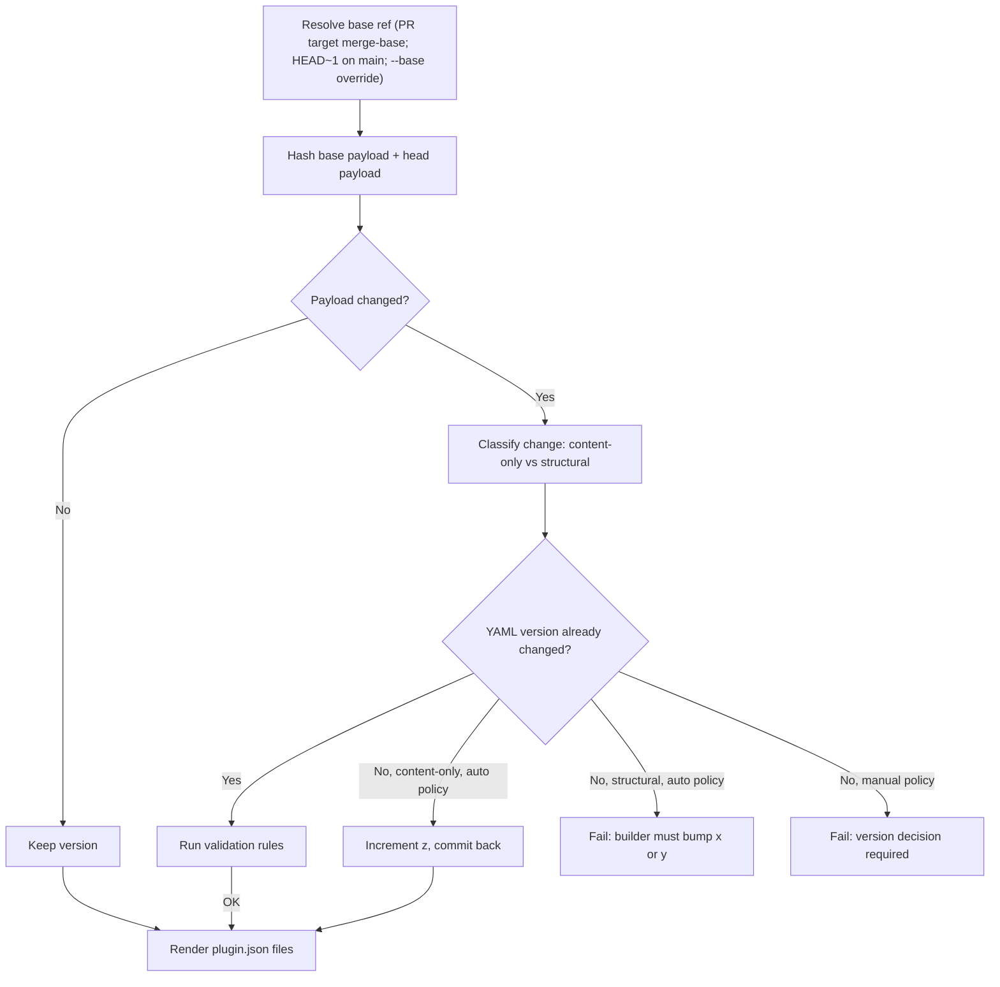

# Plugin Versioning Strategy

## Important Links

- [Claude Code plugins reference](https://code.claude.com/docs/en/plugins-reference)
- [OpenAI Codex build plugins docs](https://developers.openai.com/codex/plugins/build)
- [Anthropic official Claude plugin marketplace](https://github.com/anthropics/claude-plugins-official)
- [OpenAI curated Codex plugins repo](https://github.com/openai/plugins)

## BLUF

Use **independent SemVer per plugin**.

NVIDIA plugin builders own the `x.y` stream. Automation only owns the `z` stream.

```yaml
# plugins.d/nvidia-skills.yml
name: nvidia-skills
version: "1.2.3"
# version_policy: auto    # inherited from plugins.d/_defaults.yml; override here only if needed
include_skills:
  - skills/aiq-deploy/
  - skills/aiq-research/
```

```yaml
# plugins.d/_defaults.yml — applies to every catalog plugin
version: "1.0.0"
version_policy: auto       # auto | manual
```

Decision:

- `1.2.x` patch changes: automation may update `z` and commit the change back to the PR branch (see [Writeback Mechanism](#writeback-mechanism)).
- `1.x` or `x.y` changes: NVIDIA plugin builders update YAML `version`.
- Generated `.claude-plugin/plugin.json` and `.codex-plugin/plugin.json` copy YAML `version`.

## Scope

In scope:

- **Catalog plugins** (driven by `plugins.d/<name>.yml`). `plugin.json` is generated; YAML `version` is the source of truth.

Out of scope:

- **Curated plugins** (driven by `plugins/<name>/.skills-manifest.yml`, where `plugin.json` is hand-maintained). These are always treated as `version_policy: manual`. Their hand-maintained `.claude-plugin/plugin.json` is the source of truth; automation never edits it.
- **Marketplace entries** (`.claude-plugin/marketplace.json`, `.agents/plugins/marketplace.json`). They do not carry per-plugin version fields. Per-plugin `plugin.json` is authoritative; clients prefer it over the marketplace entry (see [Research Appendix](#research-appendix)).
- **Marketplace `metadata.version`** stays static; bumping it is a separate decision.

## Why This Matters

Users need version numbers to mean something:

- **No version change**: no meaningful shipped change.
- **Patch**: refreshed existing skill content.
- **Minor**: plugin capability set changed.
- **Major**: review before updating.

This keeps update prompts trustworthy and gives external marketplaces a clear handoff version.

## Ownership Model

| Version Part | Owner | Examples |
|---|---|---|
| `x` major | NVIDIA plugin builders | breaking behavior, rename, large compatibility shift |
| `y` minor | NVIDIA plugin builders | skill added, skill removed, capability/default prompt changed, new logo/composer_icon/screenshot or asset removed (user-visible discovery surface) |
| `z` patch | automation, when policy is `auto` | existing skill instructions/references/evals/scripts changed, in-place asset byte changes (resized logo, recompressed screenshot) |

Automation should never infer minor or major.

Pre-release tags (`1.2.3-rc1`, `1.2.3+sha`) are **not** supported in YAML `version`. Both Claude and Codex compare SemVer semantically; pre-release ordering is an extra failure mode we don't need yet. Validation rejects them.

Skill removal (default rule): treat as `y` in `0.x` and `1.x`; once any plugin reaches `2.0` and we commit to API stability, treat as `x`. Codify this in the validator so reviewers don't relitigate every PR.

## Version Policy

| Policy | Behavior |
|---|---|
| `auto` | If only existing included skill content changed, automation increments `z`. If the PR already changed YAML `version`, automation validates it and does not bump again. |
| `manual` | Automation never edits YAML `version`. If payload changed and YAML `version` did not, automation reports that a version decision is needed and fails CI. |

`version_policy: auto` is the default in `plugins.d/_defaults.yml`, so individual plugin yamls don't need to set it. Override per-plugin only to opt into `manual`.

When the bumped plugin doesn't yet override `version` in its own yaml (still inheriting `1.0.0` from `_defaults.yml`), automation writes the new version into **that plugin's** `plugins.d/<name>.yml`, never into `_defaults.yml`. The first auto-bump for a fresh plugin promotes `1.0.0 → 1.0.1` into the plugin yaml.

### Validation Rules

Whenever automation runs in `auto` mode and the PR already changed YAML `version`, automation applies these rules and fails with a clear message on any violation:

1. **Monotonic**: new version must be strictly greater than base version (SemVer compare).
2. **Magnitude matches change**:
    - Structural change (skill added, skill removed, capability/default_prompt change, asset added/removed) → builder must bump `y` or `x`. A `z`-only bump is **rejected**.
    - Pure content change → any of `z`, `y`, `x` is acceptable (builders may signal a release intentionally).
3. **No pre-release tags**: `version` must match `^\d+\.\d+\.\d+$`. `-rc`/`+sha` suffixes are rejected.
4. **No skipping**: `1.2.3 → 1.2.99` is allowed; `1.2.3 → 5.0.0` requires the PR to include a `MAJOR_BUMP.md` note (or equivalent explicit signal — pick a convention). This is a guardrail against typos and accidental keystrokes.

In `manual` mode, automation runs the same validations but never writes a new version itself; it reports findings and exits non-zero when payload changed without a `version` change.

### Machine-driven contexts (`--auto-structural`)

The strict "structural change requires builder bump" rule assumes a human is authoring the PR and can make the decision before CI runs. The daily skill sync is different: skills can be added or removed by upstream renames, compliance drops, or product moves, and there is no human in the loop until the sync PR exists.

For machine-driven flows, automation runs with `--auto-structural`, which downgrades structural-change-without-bump from a failure to a y-bump. The PR reviewer is the effective builder: they see the structural change *and* its y-bump in one diff and can accept, override, or close.

`--auto-structural` is off by default. Only the sync workflow uses it. Contributor PRs run without the flag so the strict rule still applies.

## Builder DX

### Existing Skill Content Changed

Builder changes an existing included skill:

```text
skills/aiq-deploy/SKILL.md
```

Automation result:

```text
1.2.3 -> 1.2.4
```

No builder version edit required when `version_policy: auto`.

### Skill Added Or Removed

Builder changes plugin composition:

```yaml
include_skills:
  - skills/aiq-deploy/
  - skills/aiq-research/
  - skills/new-skill/
```

Builder must also update YAML `version`:

```yaml
version: "1.3.0"
```

Automation validates the version and does not bump again.

### Human Override Rule

If the PR already changes YAML `version`, automation treats that as intentional.

Example:

```text
Base version: 1.2.0
PR adds a skill
PR version: 1.3.0
Automation keeps: 1.3.0
```

Bad behavior to avoid:

```text
1.2.0 -> 1.3.0 by builder -> 1.4.0 by automation
```

## Writeback Mechanism

Decision: **CI bumps `z` and commits the change back to the PR branch** before `build-plugins.py --check` runs the drift guard.

Flow on every PR with `version_policy: auto`:

1. CI checks out the PR head with a token that can push back to the PR branch (e.g. a deploy key or a GitHub App token, not the default `GITHUB_TOKEN` if the PR is from a fork — fork PRs degrade to "comment with the proposed bump and require the builder to push it").
2. CI runs the versioning analyzer: computes base-payload hash and head-payload hash, classifies the change (none / content-only / structural), and decides whether to bump.
3. If a bump is warranted and the YAML `version` was not already changed in the PR:
    - Rewrite `plugins.d/<name>.yml` with the new version (preserving comments and key order via `ruamel.yaml`, not `pyyaml`).
    - Re-run `build-plugins.py` so generated `plugin.json` files reflect the bump.
    - Commit with a fixed message (e.g. `chore(version): bump <plugin> to <new>`) and push back to the PR branch using the bot identity.
4. CI then runs `build-plugins.py --check` for the drift guard. The auto-bump commit + regenerated `plugin.json`s mean the tree is clean.

Fork-PR handling: when push-back is impossible, automation comments the proposed bump on the PR and fails CI with a clear "builder must apply this bump before merge" message.

Manual-policy plugins skip steps 2–3 entirely; CI only runs validation and the drift guard.

The CI bot identity must be allow-listed against `CODEOWNERS` for `plugins.d/**` so the auto-bump commit can land without a human approval.

## Build Algorithm



## Payload Comparison

Compare what users actually receive.

### Base ref resolution

| Context | Base ref |
|---|---|
| PR build | merge-base of PR head and PR target branch (`origin/main` in practice) |
| Push to `main` (post-merge) | `HEAD~1` |
| Local dev | explicit `--base <ref>` flag; fail loudly with a clear message if absent |
| Daily auto-sync PR | merge-base, same as any other PR |

Automation must materialize the base payload too. Two viable approaches: (a) `git worktree add` the base ref to a temp dir and run `build-plugins.py` there, or (b) compute the base hash from raw source files without materializing. (a) is simpler and matches what users actually receive; recommend (a).

### Included in the hash

- effective plugin config after `_defaults.yml` merge (the spec dict that `build-plugins.py` produces, minus the excluded fields below)
- resolved `include_skills` after expansion (the list of `(skill_basename, source_path)` pairs)
- every regular file under each materialized skill directory, hashed by byte content:
    - `SKILL.md`
    - `references/**`
    - `evals/**`
    - `scripts/**`
    - any other tracked file inside the skill directory
- referenced shipped asset bytes (`logo`, `composer_icon`, every entry in `screenshots`) — byte content, not just paths, so a resized logo bumps `z`
- user-visible `plugin.json` fields except `version` (see exclusions)

### Excluded from the hash

- YAML `version`
- YAML `version_policy`
- generated `plugin.json.version`
- file path glob exclusions: `**/__pycache__/**`, `**/.DS_Store`, `**/*.pyc`, `**/*.pyo`, `**/*.swp`, `**/.idea/**`, `**/.vscode/**`
- `plugins/<name>/.skills-manifest.yml` (spec, not payload — and only present on curated plugins, which are out of scope anyway)
- timestamps, file mtimes, generated marketplace ordering noise, local development metadata

### Symlink handling

When `skill_files: symlink`, the hash must resolve symlinks and hash the **target** bytes under the canonical `skills/` tree. Equivalently: run `build-plugins.py` against a `skill_files: copy` override for the hash pass, or `os.walk(followlinks=True)` and hash regular files. Hashing symlink link-text would produce stable hashes even when skill content changes — that's wrong.

The hash itself does not need to be stored. Automation computes one hash for the base ref and one for the head payload, in-memory, per CI run.

## Manifest Contract

Generated manifests must copy YAML `version`. Snippets below show only the `version`-relevant fields; the build emits many more fields (`description`, `displayName`, `author`, `homepage`, `repository`, `license`, `keywords`, `interface`, etc.) — see `render_claude_plugin_json` and `render_codex_plugin_json` in `.github/scripts/build-plugins.py` for the full schemas.

Claude (`plugins/<name>/.claude-plugin/plugin.json`, abbreviated):

```json
{
  "name": "nvidia-skills",
  "version": "1.2.4",
  "skills": ["./skills/"]
}
```

Codex (`plugins/<name>/.codex-plugin/plugin.json`, abbreviated):

```json
{
  "name": "nvidia-skills",
  "version": "1.2.4",
  "skills": "./skills/"
}
```

Automation should report a validation finding if generated manifests do not match YAML `version`. Marketplace entries (`.claude-plugin/marketplace.json`, `.agents/plugins/marketplace.json`) do not carry a `version` field by design (see [Scope](#scope)).

## External Marketplace Impact

NVIDIA's generated plugin package is the source of truth. External marketplaces may pin by SHA, copy files, or review manually, but they should not invent a different NVIDIA plugin version.

### Anthropic Official Claude Plugins

`anthropics/claude-plugins-official` can list external plugins by Git source plus pinned commit SHA.

- SHA answers: "What exact source did Anthropic pull?"
- Plugin version answers: "What release did users get?"
- Our `.claude-plugin/plugin.json` version should be correct before Anthropic updates the pinned SHA.

### OpenAI Curated Codex Plugins

`openai/plugins` stores curated plugin folders with `.codex-plugin/plugin.json`.

- The generated `.codex-plugin/plugin.json` version is the handoff contract.
- The OpenAI PR should copy the NVIDIA plugin version exactly.
- The PR should include source commit and version delta, for example `1.2.3 -> 1.2.4`.

## Acceptance Criteria

Versioning behavior:

- Existing skill content change under `version_policy: auto` increments `z`.
- In-place asset byte change (e.g. resized logo) under `auto` increments `z`.
- Skill added/removed requires builder to update `y` (or `x` once we hit `2.0` and commit to API stability).
- Asset added/removed (logo, composer_icon, screenshots) requires builder to update `y`.
- Capability/default-prompt changes require builder to update `y`.
- If YAML `version` changed in the PR, automation runs validation (monotonic, magnitude matches change, no pre-release tags, no large unexplained jumps) and does not bump again.
- `version_policy: manual` never edits YAML `version`; automation reports when a version decision is needed and fails CI.

Writeback:

- Auto-bumps land as a CI bot commit on the PR branch before drift-check.
- Fork-PR bumps surface as a CI comment with the proposed version and fail the check until the builder applies it.
- The auto-bump commit also regenerates affected `plugin.json` files so `build-plugins.py --check` passes in the same CI run.

Manifests and propagation:

- Claude and Codex `plugin.json` files copy YAML `version`.
- Publishing emits plain SemVer (`^\d+\.\d+\.\d+$`).
- External marketplace handoffs include source commit SHA and version delta (e.g. `1.2.3 -> 1.2.4`).

Curated plugins (out of scope for automation, but enforced):

- The versioning automation skips any plugin without a `plugins.d/<name>.yml`.
- Hand-maintained `.claude-plugin/plugin.json` for curated plugins is never rewritten by automation.

## Open Questions

- Should PR summaries compute per-skill diffs for clearer release notes? (Quality-of-life; not a blocker.)
- How do we surface the version delta and source SHA to external marketplace maintainers? (Manual today; could be a CI artifact / PR template snippet.)
- Should there be a "no-op release" path — bumping `z` deliberately when the payload didn't change but the builder wants to refresh client caches? (Probably no; if it's needed, do it with an explicit YAML edit.)

Resolved here, not left open:

- *Skill removal magnitude* — codified in [Ownership Model](#ownership-model): `y` until any plugin reaches `2.0`, then `x`.
- *Client auto-upgrade behavior* — Claude auto-checks every 24h, Codex requires explicit `marketplace/upgrade`. Vendor behavior, not ours to decide; document per-client UX in user-facing docs.

## Other Alternatives Considered

- **Auto-bump patch and minor**: rejected because adding/removing skills is a product capability change. NVIDIA plugin builders should own `x.y`.
- **Only manual versioning**: rejected because routine skill-content refreshes would be easy to forget and users could miss updates.
- **Use Git SHA as version**: rejected because SHA is good for source provenance, not user-facing release meaning.

## Research Appendix

Claude Code plugin docs:

- `.claude-plugin/plugin.json` supports SemVer `version`.
- If `plugin.json` omits version, Claude falls back to marketplace entry version, then source-specific values such as Git commit SHA.
- `plugin.json` version takes precedence for update detection and caching.
- Installed plugins are automatically checked for updates every 24 hours unless users disable auto-update.

Codex local behavior from this workspace:

- `.codex-plugin/plugin.json` has a top-level `version` field.
- The local plugin creator spec recommends strict SemVer for generated manifests.
- Local development has separate reinstall behavior that should not affect published plugin versions.
- The plugin store uses versioned cache directories.
- Codex tracks `localVersion` and, for remote/shared plugins, `remoteVersion`.
- The plugin store compares SemVer versions semantically when choosing the active cached plugin.
- `marketplace/upgrade` upgrades configured Git marketplaces and returns upgraded roots plus errors.

Sources:

- Claude Code Plugins Reference: https://code.claude.com/docs/en/plugins-reference
- Codex plugin sample spec: `codex/codex-rs/skills/src/assets/samples/plugin-creator/references/plugin-json-spec.md`
- Codex local update flow: `codex/codex-rs/skills/src/assets/samples/plugin-creator/references/installing-and-updating.md`
- Codex app-server plugin APIs: `codex/codex-rs/app-server/README.md`
- Codex plugin store behavior: `codex/codex-rs/core-plugins/src/store.rs`
